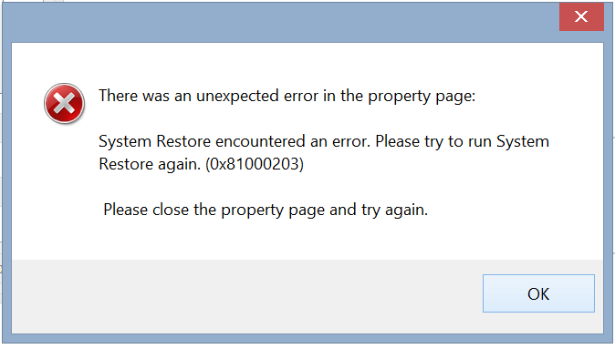
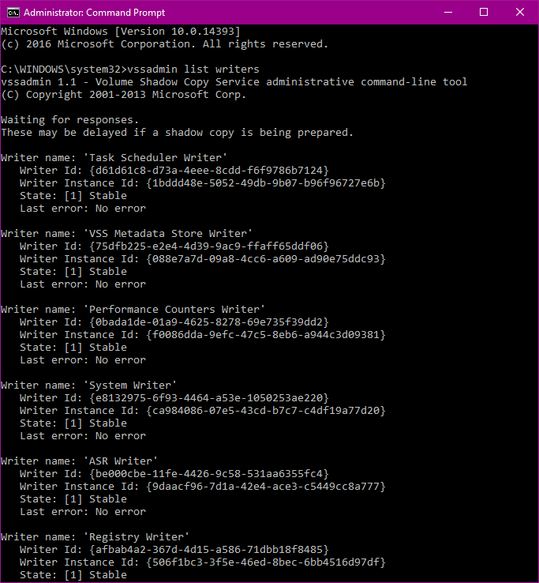
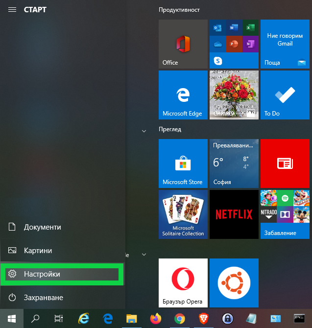
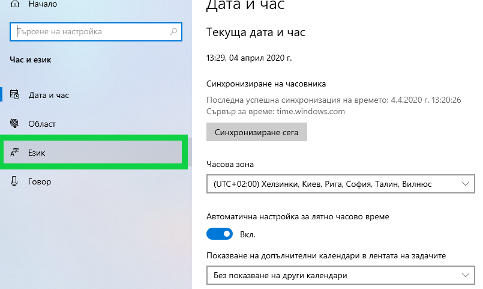
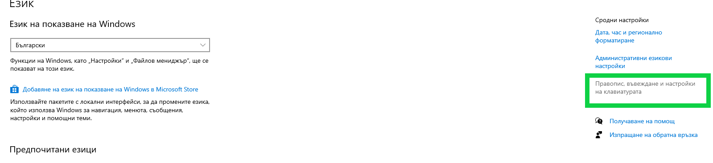
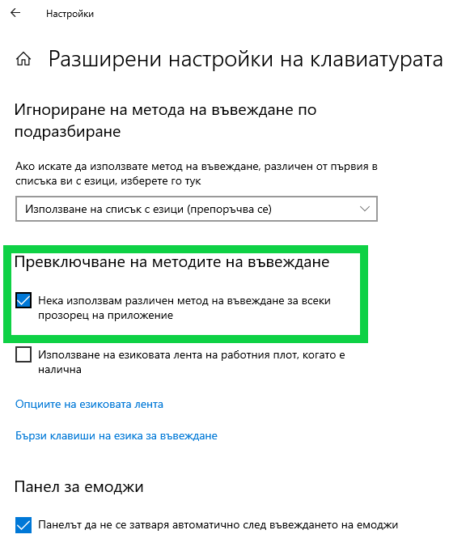
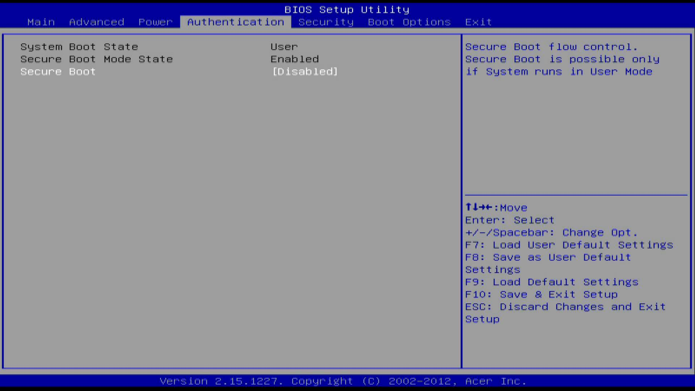
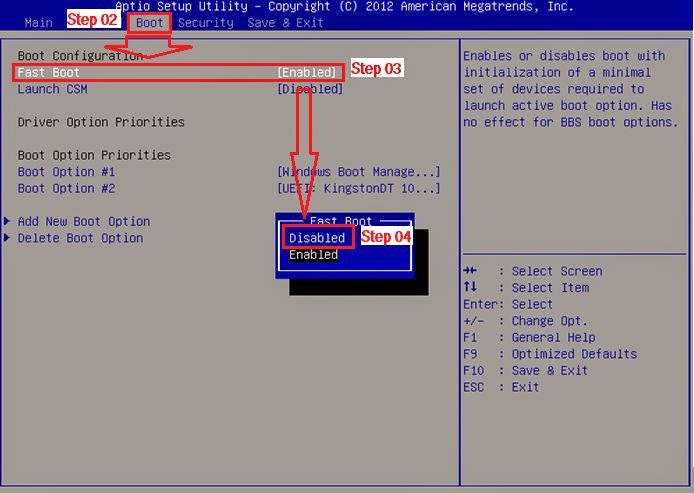
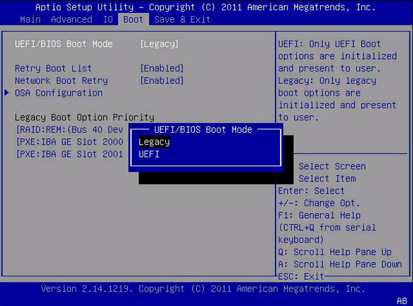
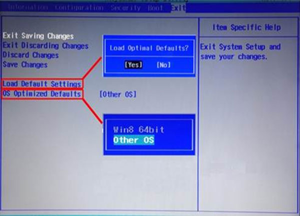

# FixWindows10

## Windows 10 Search Showing "Blank Box" Fix


RUN -> REGEDIT

HKEY_CURRENT_USER\Software\Microsoft\Windows\CurrentVersion\Search

CortanaConsent = dword 0


BingSearchEnabled = dword 0


To create BingSearchEnabled. Right click on Search and select New and then DWORD (32-bit) Value and name it BingSearchEnabled and set it to 0

## Change Default RDP Port

HKEY_LOCAL_MACHINE\System\CurrentControlSet\Control\Terminal Server\WinStations\RDP-Tcp\PortNumber

Edit > Modify > Decimal. Type the new port number > OK. Restart the computer.

## System Restore, Error 0x81000203



### Step 1

1. Click Start, click Run, type Regedit, and then click OK.
2. Locate and then click the following registry subkey:
>HKEY_LOCAL_MACHINE\SOFTWARE\Microsoft\EventSystem\{26c409cc-ae86-11d1-b616-00805fc79216}\Subscriptions
3. On the Edit menu, click Delete, and then click Yes to confirm that you want to delete the subkey.
4. Exit Registry Editor.
5. Click Start, click Run, type services.msc, and then click OK.
6. Right-click the following services one at a time. For each service, click Restart:
 - COM+ Event System
 - COM+ System Application
 - Microsoft Software Shadow Copy Provider
 - Volume Shadow Copy
7. Click Start, click Run, type cmd, and then click OK.
8. At the command prompt, type vssadmin list writers, and then press ENTER.
9. If the VSS writers are now listed, close the Command Prompt window. You do not have to complete the remaining steps.


If the VSS writers are not listed, type the following commands at the command prompt. Press ENTER after each command.
 - cd /d %windir%\system32
- net stop vss
- net stop swprv
- regsvr32 ole32.dll
- regsvr32 oleaut32.dll
- regsvr32 /i eventcls.dll
- regsvr32 vss_ps.dll
- vssvc /register
- regsvr32 /i swprv.dll
- regsvr32 es.dll
- regsvr32 stdprov.dll
- regsvr32 vssui.dll
- regsvr32 msxml.dll
- regsvr32 msxml3.dll
- regsvr32 msxml4.dll


Note The last command may not run successfully.


10. At the command prompt, type vssadmin list writers, and then press ENTER.
11. Confirm that the VSS writers are now listed.

In the end, it should be similar to this to continue



After that, do this, however, you may not be able to change it to "volsnap". Remember how I showed you to change the permissions of "Volume". Now you have to change the owner for all values under "Volume" using the same method (for example: {0695aa21-6522-11e6-b157-806e6f6e6963}#0000000000100000). I have 13 values so I had to change the owner 13 times :(. perhaps you have less.

### Step 2

12. Navigate to:
>HKEY_LOCAL_MACHINE\SYSTEM\CurrentControlSet\Enum\STORAGE\Volume
13. For each key under 'Volume', checked for the value 'Service' and make sure it is set to volsnap. If 'Service' does not exist do the following:
 - Created a new String Value called: Service
 - Set the value to: volsnap

Finally, reboot to make it work. Without reboot, you still have the problem


Source - https://malwaretips.com/threads/error-0x81000203.63564/page-7

## Relocating OST Data Files 1

### Force Path

1. Press the Windows + R button, type regedit, and then press Enter.
2. Navigate through the following registry path:
> HKEY_CURRENT_USER\Software\Microsoft\Office\version number\Outlook
3. Right-click the Outlook sub key, point to New, and then click the Expandable String Value option.
4. Specify ForceOSTPath. Press the Enter key.
5. Right-click the newly-created ForceOSTPath. Click the Modify option.
6. Specify OST file path for saving in the Value box. Click the OK button.
7. Exit the registry editor.

## Relocating OST Data Files 2

### Using Symbolic Links or Junction Points

1. Close outlook that is in use.
2. The default location is:
>%localappdata%\Microsoft\Outlook


Move the OST-file or PST-file from its original location to its new location.


3. Open Command prompt using Windows+R keys, Run as Administrator. Provide all the administrator credentials for your computer by selecting yes to allow the prompt.
4. Type the following commands:
>mklink “C:\Users\%username%\AppData\Local\Microsoft\Outlook\ datafile.ost” “D:\Documents\Outlook Files\ datafile.ost“

Where, mklink is used to create symbolic link;

The PowerShell command is:
>New-Item -ItemType SymbolicLink -Path "C:\Users\%username%\AppData\Local\Microsoft\Outlook\outlookcom.ost" -Value "D:\Documents\Outlook Files\outlookcom.ost"

## Outlook 365 searches emails in server by default

Key
>HKEY_CURRENT_USER\Software\Microsoft\Office\16.0\Outlook\Options\Search

Name
>DisableServerAssistedSearch

Type
>REG_DWORD

Value
>1

## Outlook search .ost file instead of Exchange server

creating 2 DWORD keys in
>HKEY_CURRENT_USER\software\microsoft\office\16.0\outlook\search

>DisableServerAssistedSearch

>DisableServerAssistedSuggestions

Set both keys to 1, restart Outlook and everything should work.Type a message

## Fix Outlook Out of Office reply - Your Out of Office settings cannot be displayed, because the server is currently unavailable. Try again later

copy and rename the folowing folder to Outlook.old

>C:\Users\svetlozar\AppData\Local\Microsoft\Outlook

Open Outlook and make sure that the exchange addin is enabled

Make a note of the OOF reply when testing the Outlook connection and open it

Create the following key
>HKEY_CURRENT_USER\Software\Microsoft\Office\<version>\Outlook\Security

>Value name: WinhttpAuth

>Value type: REG_DWORD 32 bit

>Value: 1 or 2

Create the following keys under:

>HKEY_CURRENT_USER\Software\Microsoft\Office\x.0\Outlook\AutoDiscover


>PreferLocalXML					0

>ExcludeHttpRedirect				0

>ExcludeHttpsAutoDiscoverDomain	0

>ExcludeHttpsRootDomain			1

>ExcludeScpLookup				1

>ExcludeSrvRecord				1

>ExcludeLastKnownGoodURL(only applies to Outlook 2010 version 14.0.7140.5001 and later versions)

>ExcludeExplicitO365Endpoint (only applies to Outlook 2016 version 16.0.6741.2017 and later versions)

## Show total numbers of Emails in all folders in Outlook

1. Press Alt + F11 keys to open the Microsoft Visual Basic
2. Click Insert > Module, and then paste the VBA code below

```vbs
Sub ShowTotalInAllFolders()
Dim oStore As Outlook.Store
Dim oRoot As Outlook.Folder
 
On Error Resume Next
 
For Each oStore In Application.Session.Stores
Set oRoot = oStore.GetRootFolder
ShowTotalInFolders oRoot
Next
End Sub
 
Private Sub ShowTotalInFolders(ByVal Root As Outlook.Folder)
Dim oFolder As Outlook.Folder
 
On Error Resume Next
 
If Root.Folders.Count > 0 Then
For Each oFolder In Root.Folders
oFolder.ShowItemCount = olShowTotalItemCount
ShowTotalInFolders oFolder
Next
End If
End Sub
```

## How to set a different input method for each app window

>Settings




>Time&Language


>Language




>Related Settings: Spelling, typing, & keyboard settings




>More keyboard settings: Advanced keyboard settings


>Let me set a different input method for each app window




Source - https://superuser.com/questions/772698/how-to-set-a-different-input-method-for-each-app-window

## Blue Screen Viewer
https://www.nirsoft.net/utils/blue_screen_view.html

Download: https://www.nirsoft.net/utils/bluescreenview.zip

## Something Went Wrong and your search couldn't be completed (Outlook 2020)


You shuld create the following 32-bit DWORD **DisableServerAssistedSearch** with value **1** in regedit:

>Computer\HKEY_CURRENT_USER\Software\Microsoft\Office\16.0\Office\16.0\Outlook\Search

If the issue still persists, please add the same DWORD under the following key:

>Computer\HKEY_CURRENT_USER\software\microsoft\office\16.0\outlook\search

## How to Enable Boot from CD, DVD and USB boot Option with UEFI Boot Mode Enabled for Windows 8, 8.1 and 10

1. Boot to the BIOS
2. Disable Secure boot



3. Disable Fast boot (if available)


<br>
4. Change UEFI to Legacy Boot


<br>

5. Navigate to the EXIT menu and select Yes to continue to disable the OS Optimized Defaults



## Office 365 won't log in without EnableADAL = 0

HKEY_CURRENT_USER\Software\Microsoft\Office\16.0\Common\Identity, create a DWORD value named EnableADAL and set it to zero.
Under the same registry key, create a DWORD value named DisableADALatopWAMOverride and set it to 1

## Enable GPedit in Windows 10 Home

run this in cmd.exe as an admin:

> pushd "%~dp0" 

> dir /b %SystemRoot%\servicing\Packages\Microsoft-Windows-GroupPolicy-ClientExtensions-Package~3*.mum >List.txt 

> dir /b %SystemRoot%\servicing\Packages\Microsoft-Windows-GroupPolicy-ClientTools-Package~3*.mum >>List.txt 

> for /f %%i in ('findstr /i . List.txt 2^>nul') do dism /online /norestart /add-package:"%SystemRoot%\servicing\Packages\%%i" 

> pause

## Multiple connections to a server or shared resource by the same user, using more than one user name, are not allowed

> net use \\<resource> /delete

> Get-Service workstation | Restart-Service -Force

## Enable Hyper-V in Windows Home

```bat
pushd "%~dp0"
dir /b %SystemRoot%\servicing\Packages\*Hyper-V*.mum >hyper-v.txt
for /f %%i in ('findstr /i . hyper-v.txt 2^>nul') do dism /online /norestart /add-package:"%SystemRoot%\servicing\Packages\%%i"
del hyper-v.txt
Dism /online /enable-feature /featurename:Microsoft-Hyper-V -All /LimitAccess /ALL
pause
```

## Resolve MS Office TPM Error


```bat
reg add "HKCU\Software\Microsoft\Office\16.0\Common\Identity" /v EnableADAL /t REG_DWORD /d 0 /f
reg add "HKCU\Software\Microsoft\Office\16.0\Common\Identity" /v DisableADALatopWAMOverride /t REG_DWORD /d 1 /f
```

## Fix problems that block programs from being installed or removed

[Microsoft Troubleshooter](https://download.microsoft.com/download/7/E/9/7E9188C0-2511-4B01-8B4E-0A641EC2F600/MicrosoftProgram_Install_and_Uninstall.meta.diagcab)