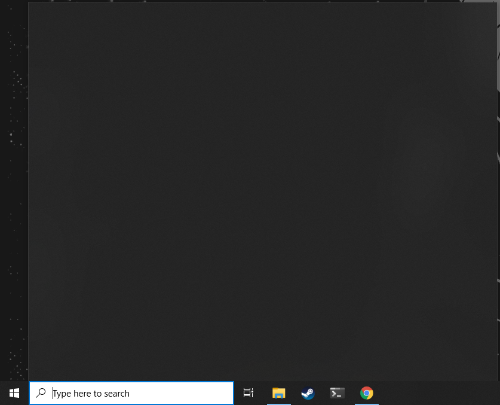

# FixWindows10
 
## Windows 10 Search Showing "Blank Box" Fix

RUN -> REGEDIT

HKEY_CURRENT_USER\Software\Microsoft\Windows\CurrentVersion\Search

CortanaConsent = dword 0

BingSearchEnabled = dword 0

To create BingSearchEnabled. Right click on Search and select New and then DWORD (32-bit) Value and name it BingSearchEnabled and set it to 0

## Change Default RDP Port

HKEY_LOCAL_MACHINE\System\CurrentControlSet\Control\Terminal Server\WinStations\RDP-Tcp\PortNumber

Edit > Modify > Decimal. Type the new port number > OK. Restart the computer.

## System Restore, Error 0x81000203

1)

1. Click Start, click Run, type Regedit, and then click OK.
2. Locate and then click the following registry subkey:
HKEY_LOCAL_MACHINE\SOFTWARE\Microsoft\EventSystem\{26c409cc-ae86-11d1-b616-00805fc79216}\Subscriptions
3. On the Edit menu, click Delete, and then click Yes to confirm that you want to delete the subkey.
4. Exit Registry Editor.
5. Click Start, click Run, type services.msc, and then click OK.
6. Right-click the following services one at a time. For each service, click Restart:
 - COM+ Event System
 - COM+ System Application
 - Microsoft Software Shadow Copy Provider
 - Volume Shadow Copy
7. Click Start, click Run, type cmd, and then click OK.
At the command prompt, type vssadmin list writers, and then press ENTER.
If the VSS writers are now listed, close the Command Prompt window. You do not have to complete the remaining steps.

If the VSS writers are not listed, type the following commands at the command prompt. Press ENTER after each command.
cd /d %windir%\system32
net stop vss
net stop swprv
regsvr32 ole32.dll
regsvr32 oleaut32.dll
regsvr32 /i eventcls.dll
regsvr32 vss_ps.dll
vssvc /register
regsvr32 /i swprv.dll
regsvr32 es.dll
regsvr32 stdprov.dll
regsvr32 vssui.dll
regsvr32 msxml.dll
regsvr32 msxml3.dll
regsvr32 msxml4.dll
Note The last command may not run successfully.
At the command prompt, type vssadmin list writers, and then press ENTER.
Confirm that the VSS writers are now listed.

In the end, it should be similar to this to continue

After that, do this, however, you may not be able to change it to "volsnap". Remember how I showed you to change the permissions of "Volume". Now you have to change the owner for all values under "Volume" using the same method (for example: {0695aa21-6522-11e6-b157-806e6f6e6963}#0000000000100000). I have 13 values so I had to change the owner 13 times :(. perhaps you have less.

2)

2. Navigate to: HKEY_LOCAL_MACHINE\SYSTEM\CurrentControlSet\Enum\STORAGE\Volume
3. For each key under 'Volume', checked for the value 'Service' and make sure it is set to volsnap. If 'Service' does not exist do the following:
a. Created a new String Value called: Service
b. Set the value to: volsnap

Finally, reboot to make it work. Without reboot, you still have the problem

https://malwaretips.com/threads/error-0x81000203.63564/page-7

